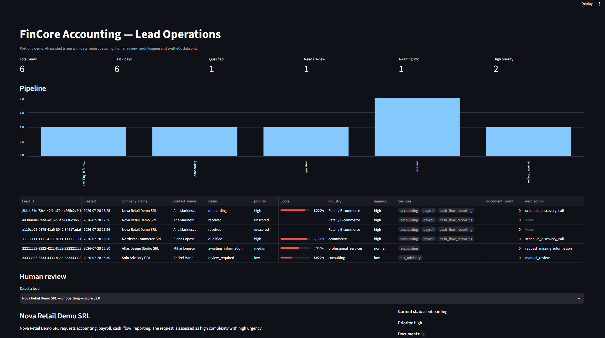
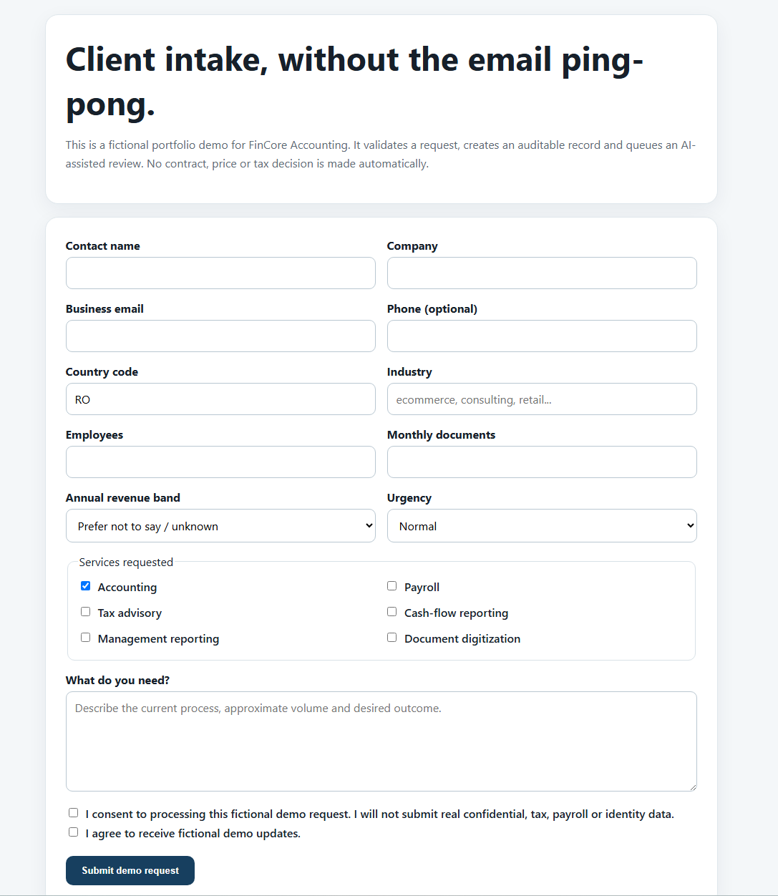
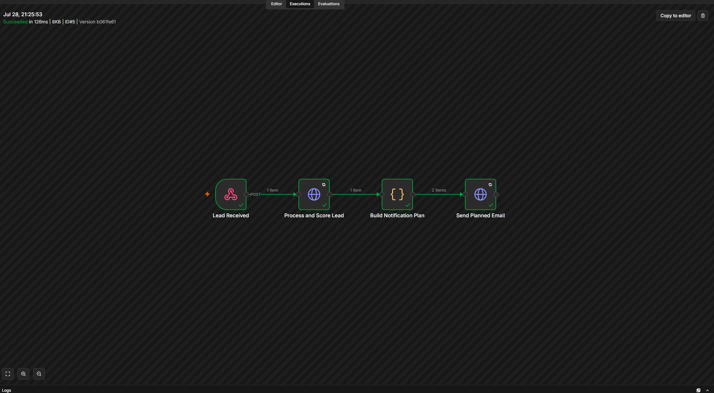
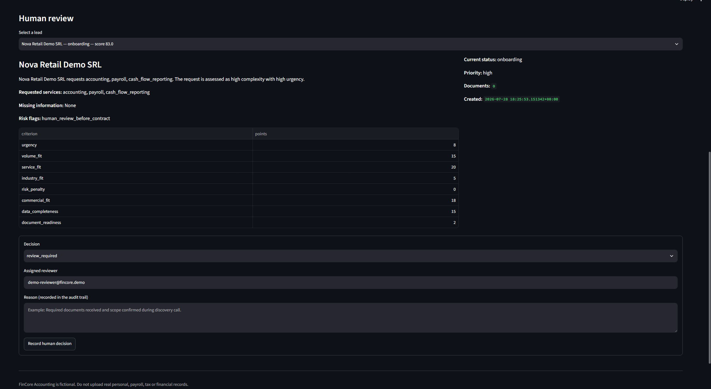
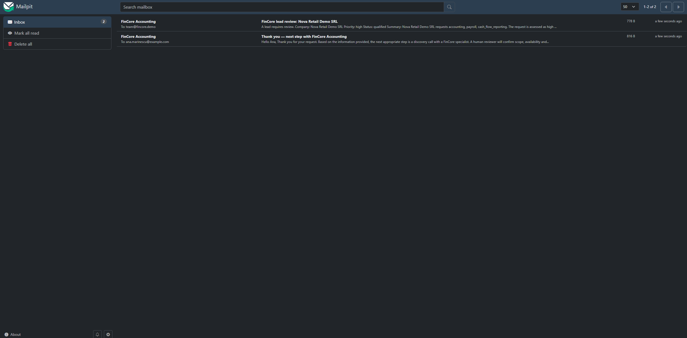
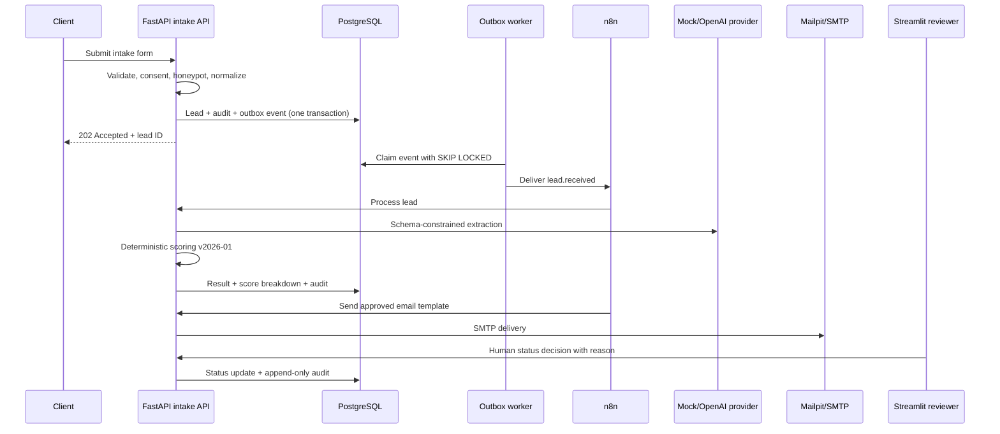
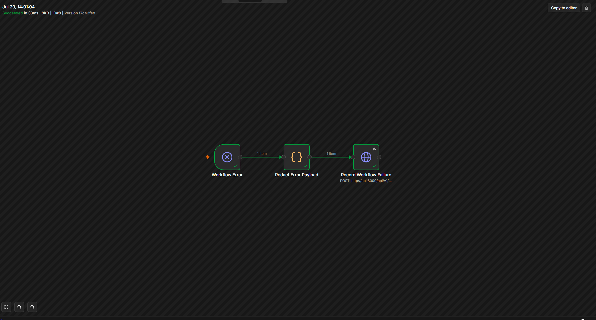

# FinCore — AI-Assisted Client Intake & Onboarding for Accounting Firms

[](https://github.com/cosminchirita/fincore-ai-client-intake-onboarding/actions/workflows/ci.yml)


A production-minded portfolio project that automates client intake, AI-assisted lead classification, explainable scoring, controlled notifications and human-reviewed onboarding for a fictional accounting firm.

<p align="center">
  
</p>

<p align="center">
  <em>
    Lead pipeline, explainable scoring, priority classification and
    human-in-the-loop review.
  </em>
</p>

> **Synthetic data only.** FinCore Accounting is fictional. Do not submit real payroll, identity, tax, banking or confidential business records.

## Project status

- End-to-end workflow validated locally
- GitHub Actions CI passing
- 9 automated tests passing
- Deterministic zero-cost AI demo enabled by default
- Human review required before onboarding or contractual decisions
- Exported n8n workflows included
- Docker-based local environment

## Why this project exists

Most automation demos stop at “form → LLM → email.” This repository demonstrates the engineering controls expected around a real financial workflow:

- deterministic validation before AI;
- schema-constrained AI output and server-side validation;
- explainable, versioned scoring separate from the model;
- human approval before onboarding, rejection, pricing or contract decisions;
- transactional outbox delivery with retry and dead-letter behavior;
- append-only audit events and correlation IDs;
- document size/type validation and SHA-256 deduplication;
- PostgreSQL/Supabase-compatible schema and RLS policies;
- local, zero-cost AI demo mode;
- testable services, Docker Compose and CI.

## Product walkthrough

<table>
  <tr>
    <td width="50%" valign="top">
      <h3 align="center">Client intake</h3>
      
      <p>
        Privacy-aware intake form with consent, validation, business context
        and requested service selection.
      </p>
    </td>
    <td width="50%" valign="top">
      <h3 align="center">Workflow orchestration</h3>
      
      <p>
        Automated validation, explainable scoring, notification planning and
        controlled email delivery.
      </p>
    </td>
  </tr>
  <tr>
    <td width="50%" valign="top">
      <h3 align="center">Explainable human review</h3>
      
      <p>
        Reviewers inspect the score breakdown, assign responsibility and
        record an auditable decision reason.
      </p>
    </td>
    <td width="50%" valign="top">
      <h3 align="center">Controlled email delivery</h3>
      
      <p>
        Mailpit captures the internal notification and synthetic client
        response without delivering real email.
      </p>
    </td>
  </tr>
</table>

## Demo flow



## Repository structure

```text
.
├── db/
│   ├── migrations/        # schema, RLS and reporting views
│   └── seed/              # fully fictional demo records
├── docs/                  # product, architecture, security, runbook and case study
├── prompts/               # versioned human-readable prompts
├── schemas/               # published AI JSON contract
├── services/
│   ├── api/               # FastAPI validation, AI, scoring, uploads, email and audit
│   ├── dashboard/         # Streamlit operational review UI
│   └── worker/            # reliable transactional-outbox dispatcher
├── workflows/n8n/         # importable orchestration and error workflows
├── tests/                 # deterministic unit tests
├── docker-compose.yml
└── .env.example
```

## Quick start

### Requirements

- Docker Desktop or Docker Engine with Docker Compose v2
- At least 4 GB RAM recommended
- Ports `8000`, `8501`, `5678`, `8025` and `5432` available
- Python 3.12+ only for local tests and helper scripts

### 1. Create the local environment file

#### Windows PowerShell

```powershell
Copy-Item .env.example .env
```

#### macOS or Linux

```bash
cp .env.example .env
```

Open `.env` and replace all placeholder secrets with unique local values.

For the free deterministic demo, keep:

```dotenv
AI_PROVIDER=mock
OPENAI_API_KEY=
```

The mock provider does not call external AI services and does not generate OpenAI API costs.

Never commit the `.env` file. Only `.env.example` should be stored in Git.

### 2. Start the local environment

```bash
docker compose up --build -d
```

Verify that all services are running:

```bash
docker compose ps
```

The expected services are:

- `db`
- `api`
- `worker`
- `dashboard`
- `n8n`
- `mailpit`

Check the API health endpoint:

#### Windows PowerShell

```powershell
Invoke-RestMethod http://localhost:8000/health
```

#### macOS or Linux

```bash
curl http://localhost:8000/health
```

Expected response:

```json
{
  "status": "ok",
  "service": "fincore-intake-api"
}
```

### 3. Open the local applications

| Surface | URL | Purpose |
|---|---|---|
| Intake form | `http://localhost:8000` | Submit a synthetic client request |
| API documentation | `http://localhost:8000/docs` | Inspect and test API contracts |
| Lead dashboard | `http://localhost:8501` | Review leads and record human decisions |
| n8n | `http://localhost:5678` | Configure and monitor workflow orchestration |
| Mailpit | `http://localhost:8025` | Inspect locally captured demo emails |

### 4. Configure n8n

On the first visit to `http://localhost:5678`, create the local n8n owner account.

Import the workflows in this order:

1. `workflows/n8n/fincore_error_handler.json`
2. `workflows/n8n/fincore_lead_intake.json`

Create a `Header Auth` credential using:

- **Header name:** `X-Internal-API-Key`
- **Header value:** the value of `INTERNAL_API_KEY` from `.env`

Assign the credential to these nodes:

- `Process and Score Lead`
- `Send Planned Email`
- `Record Workflow Failure`

The exported workflow files do not contain the secret credential value.

Then:

1. Save and publish `FinCore - Error Handler`.
2. Open the settings for `FinCore - Lead Intake Orchestration`.
3. Select `FinCore - Error Handler` as its error workflow.
4. Save and publish the intake workflow.

The production webhook path must remain:

```text
fincore-lead-intake
```

### 5. Submit a synthetic lead

Use the browser form at:

```text
http://localhost:8000
```

Alternatively, run the helper script:

#### Windows PowerShell

```powershell
py scripts/send_demo_lead.py
```

#### macOS or Linux

```bash
python3 scripts/send_demo_lead.py
```

The intake API returns immediately with `202 Accepted`. Processing continues asynchronously through the outbox worker and n8n.

### 6. Verify the end-to-end result

A successful execution should produce:

1. a generated lead ID;
2. a successful n8n workflow execution;
3. validated structured extraction;
4. an explainable and versioned score;
5. a new lead in the Streamlit dashboard;
6. an internal review notification in Mailpit;
7. a controlled client response in Mailpit;
8. a human-review decision recorded in the audit trail.

### 7. Stop and restart the project

Stop the services while preserving local data:

```bash
docker compose down
```

Restart them later:

```bash
docker compose up -d
```

Do not use the following command unless you intentionally want to delete the PostgreSQL and n8n volumes:

```bash
docker compose down -v
```

## AI providers

### Mock provider — default

`AI_PROVIDER=mock` uses deterministic rules. It is suitable for demonstrations, CI and offline development.

### OpenAI provider

```dotenv
AI_PROVIDER=openai
OPENAI_API_KEY=...
OPENAI_MODEL=gpt-5-mini
```

The implementation uses the Responses API with a strict JSON Schema, validates the returned object again with Pydantic, records the model and prompt version, and keeps scoring outside the model. Never expose the API key in Streamlit, browser code or n8n workflow exports.

## Scoring model

The maximum score is 100 and is intentionally understandable:

| Criterion | Maximum |
|---|---:|
| Data completeness | 15 |
| Supported service fit | 20 |
| Monthly document volume | 15 |
| Urgency | 10 |
| Industry fit | 10 |
| Document readiness | 10 |
| Commercial fit | 20 |
| Risk penalty | 0 to -20 |

Rules are versioned as `2026-01`. Missing required business information always routes the lead to `awaiting_information`. Scores below 80 route to human review. A high score can recommend `qualified`, but the system still records `human_review_before_contract`.

## Supabase deployment path

The local demo uses PostgreSQL directly so it is self-contained. The schema is compatible with Supabase PostgreSQL:

1. create a Supabase project;
2. apply migrations with the Supabase CLI;
3. store documents in a private Storage bucket instead of the local upload volume;
4. replace direct service access with a server-side service role only;
5. map authenticated reviewer roles to RLS policies;
6. never expose a service-role key in Streamlit or browser code.

See `docs/security-privacy.md` before deploying.

## Tests

```bash
python -m venv .venv
source .venv/bin/activate
pip install -e ".[dev]"
pytest
ruff check .
```

## Operational properties

- **At-least-once delivery:** outbox events may be retried; stable event IDs suppress duplicate scoring and email side effects.
- **Backpressure:** the worker claims limited batches using `FOR UPDATE SKIP LOCKED`.
- **Failure isolation:** SMTP, n8n and AI failures do not remove the original lead.
- **Auditability:** AI model, prompt version, score rules version, status changes and reviewer reasons are retained.
- **Privacy:** emails store only redacted interaction metadata, not full submitted messages.
- **Human control:** automated output cannot create a contract, price a service or make legal/tax decisions.

## Failure handling

The main orchestration is connected to a dedicated n8n error workflow.
Failure payloads are redacted before a structured error record is sent to the
internal API.

<p align="center">
  
</p>

The error workflow preserves operational visibility without exposing submitted business data or secret values.

## Production caveats

This is a portfolio-grade MVP, not a certified accounting system. Before production use add managed secrets, TLS, SSO/MFA, malware scanning, encrypted object storage, formal retention jobs, database backups with restore tests, rate limiting/WAF, immutable external audit storage, data-processing agreements, incident response and legal review for the target jurisdiction.

## Documentation

- [MVP and requirements](docs/mvp.md)
- [Architecture and distributed-systems decisions](docs/architecture.md)
- [Security, privacy and auditability](docs/security-privacy.md)
- [Product and UX specification](docs/product-design.md)
- [Operations runbook and SLOs](docs/runbook.md)
- [Implementation backlog](docs/backlog.md)
- [Portfolio case study](docs/portfolio-case-study.md)


## Reference implementation choices

The design follows official guidance for n8n Docker deployment and error workflows, Supabase local development and RLS, Streamlit interactive data tables, and OpenAI structured outputs. Links are kept in the relevant documentation files so implementation assumptions can be reviewed when dependencies change.

## License

MIT. The fictional brand, data and emails are for demonstration only.
