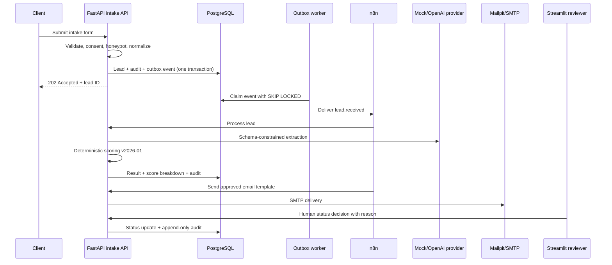

# FinCore AI-Powered Client Intake & Onboarding

A production-minded portfolio demo for a **fictional accounting firm**. The system captures a lead, validates it, queues reliable processing, extracts structured facts with AI, calculates an explainable score, sends controlled notifications and exposes a human-review dashboard.

> **Synthetic data only.** FinCore Accounting does not exist. Do not submit real payroll, identity, tax, banking or confidential business records.

## Why this project exists

Most automation demos stop at “form → LLM → email.” This repository demonstrates the engineering controls expected around a real financial workflow:

- deterministic validation before AI;
- schema-constrained AI output and server-side validation;
- explainable, versioned scoring separate from the model;
- human approval before onboarding, rejection, pricing or contract decisions;
- transactional outbox delivery with retry and dead-letter behavior;
- append-only audit events and correlation IDs;
- document size/type validation and SHA-256 deduplication;
- PostgreSQL/Supabase-compatible schema and RLS policies;
- local, zero-cost AI demo mode;
- testable services, Docker Compose and CI.

## Demo flow



## Repository structure

```text
.
├── db/
│   ├── migrations/        # schema, RLS and reporting views
│   └── seed/              # fully fictional demo records
├── docs/                  # product, architecture, security, runbook and case study
├── prompts/               # versioned human-readable prompts
├── schemas/               # published AI JSON contract
├── services/
│   ├── api/               # FastAPI validation, AI, scoring, uploads, email and audit
│   ├── dashboard/         # Streamlit operational review UI
│   └── worker/            # reliable transactional-outbox dispatcher
├── workflows/n8n/         # importable orchestration and error workflows
├── tests/                 # deterministic unit tests
├── docker-compose.yml
└── .env.example
```

## Quick start

### Requirements

- Docker Engine with Docker Compose v2
- 4 GB RAM recommended
- ports `8000`, `8501`, `5678`, `8025`, `5432` available

### 1. Configure

```bash
cp .env.example .env
```

Replace the local secrets in `.env`. Keep `AI_PROVIDER=mock` for a zero-cost deterministic demo.

### 2. Start

```bash
docker compose up --build -d
```

Open:

| Surface | URL | Purpose |
|---|---|---|
| Intake form | `http://localhost:8000` | Submit a synthetic lead |
| API docs | `http://localhost:8000/docs` | Inspect and call API contracts |
| Dashboard | `http://localhost:8501` | Review leads and record human decisions |
| n8n | `http://localhost:5678` | Import and activate workflows |
| Mailpit | `http://localhost:8025` | Inspect outbound demo emails |

On first n8n launch, create the local owner account through the n8n UI.

### 3. Import n8n workflows

Import these files in n8n:

1. `workflows/n8n/fincore_error_handler.json`
2. `workflows/n8n/fincore_lead_intake.json`

Activate the error workflow, then configure it as the error workflow for the intake workflow. Activate the intake workflow last. The production webhook path must remain `fincore-lead-intake` because the outbox worker targets it.

### 4. Send a demo lead

Use the browser form or:

```bash
python scripts/send_demo_lead.py
```

The API returns immediately with `202 Accepted`. The outbox worker delivers the event to n8n, which triggers processing and email templates.

## AI providers

### Mock provider — default

`AI_PROVIDER=mock` uses deterministic rules. It is suitable for demonstrations, CI and offline development.

### OpenAI provider

```dotenv
AI_PROVIDER=openai
OPENAI_API_KEY=...
OPENAI_MODEL=gpt-5-mini
```

The implementation uses the Responses API with a strict JSON Schema, validates the returned object again with Pydantic, records the model and prompt version, and keeps scoring outside the model. Never expose the API key in Streamlit, browser code or n8n workflow exports.

## Scoring model

The maximum score is 100 and is intentionally understandable:

| Criterion | Maximum |
|---|---:|
| Data completeness | 15 |
| Supported service fit | 20 |
| Monthly document volume | 15 |
| Urgency | 10 |
| Industry fit | 10 |
| Document readiness | 10 |
| Commercial fit | 20 |
| Risk penalty | 0 to -20 |

Rules are versioned as `2026-01`. Missing required business information always routes the lead to `awaiting_information`. Scores below 80 route to human review. A high score can recommend `qualified`, but the system still records `human_review_before_contract`.

## Supabase deployment path

The local demo uses PostgreSQL directly so it is self-contained. The schema is compatible with Supabase PostgreSQL:

1. create a Supabase project;
2. apply migrations with the Supabase CLI;
3. store documents in a private Storage bucket instead of the local upload volume;
4. replace direct service access with a server-side service role only;
5. map authenticated reviewer roles to RLS policies;
6. never expose a service-role key in Streamlit or browser code.

See `docs/security-privacy.md` before deploying.

## Tests

```bash
python -m venv .venv
source .venv/bin/activate
pip install -e ".[dev]"
pytest
ruff check .
```

## Operational properties

- **At-least-once delivery:** outbox events may be retried; stable event IDs suppress duplicate scoring and email side effects.
- **Backpressure:** the worker claims limited batches using `FOR UPDATE SKIP LOCKED`.
- **Failure isolation:** SMTP, n8n and AI failures do not remove the original lead.
- **Auditability:** AI model, prompt version, score rules version, status changes and reviewer reasons are retained.
- **Privacy:** emails store only redacted interaction metadata, not full submitted messages.
- **Human control:** automated output cannot create a contract, price a service or make legal/tax decisions.

## Production caveats

This is a portfolio-grade MVP, not a certified accounting system. Before production use add managed secrets, TLS, SSO/MFA, malware scanning, encrypted object storage, formal retention jobs, database backups with restore tests, rate limiting/WAF, immutable external audit storage, data-processing agreements, incident response and legal review for the target jurisdiction.

## Documentation

- [MVP and requirements](docs/mvp.md)
- [Architecture and distributed-systems decisions](docs/architecture.md)
- [Security, privacy and auditability](docs/security-privacy.md)
- [Product and UX specification](docs/product-design.md)
- [Operations runbook and SLOs](docs/runbook.md)
- [Implementation backlog](docs/backlog.md)
- [Portfolio case study](docs/portfolio-case-study.md)

## n8n credential configuration

After importing the workflows, create a Header Auth credential:

- Header name: `X-Internal-API-Key`
- Header value: the `INTERNAL_API_KEY` value from `.env`

Assign the credential to:

- `Process and Score Lead`
- `Send Planned Email`
- `Record Workflow Failure`

Credential values are never stored in the exported workflow JSON files.
The default `AI_PROVIDER=mock` configuration does not call external AI APIs and does not generate OpenAI usage costs.

## Reference implementation choices

The design follows official guidance for n8n Docker deployment and error workflows, Supabase local development and RLS, Streamlit interactive data tables, and OpenAI structured outputs. Links are kept in the relevant documentation files so implementation assumptions can be reviewed when dependencies change.

## License

MIT. The fictional brand, data and emails are for demonstration only.
