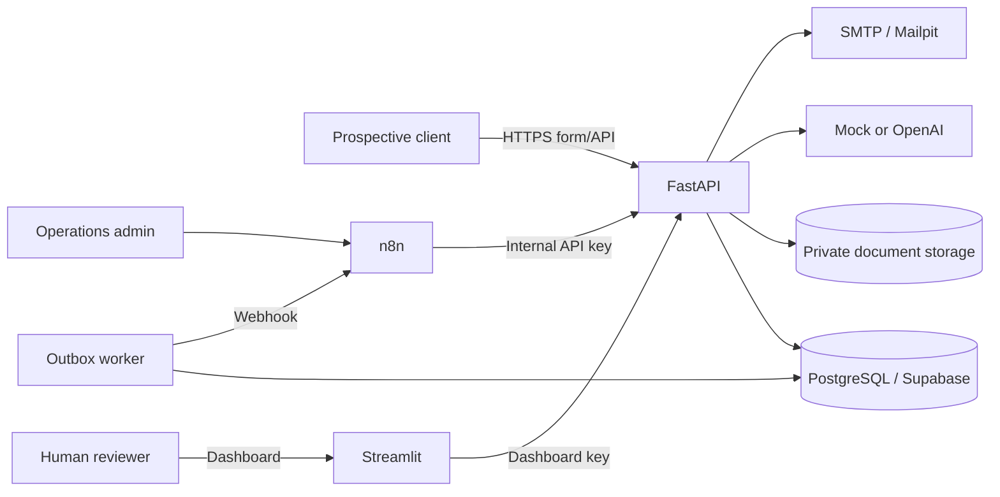
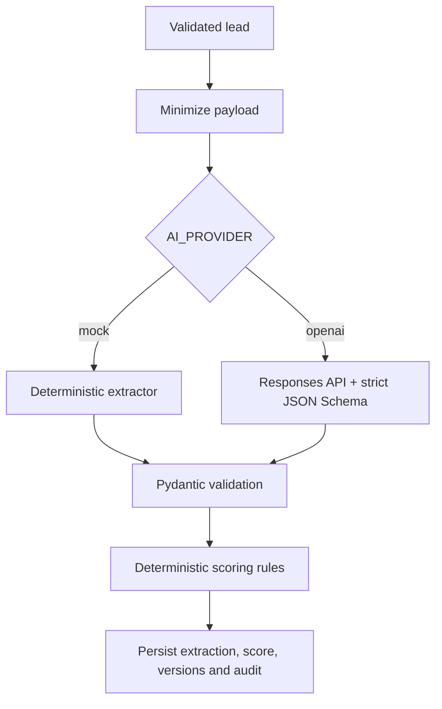
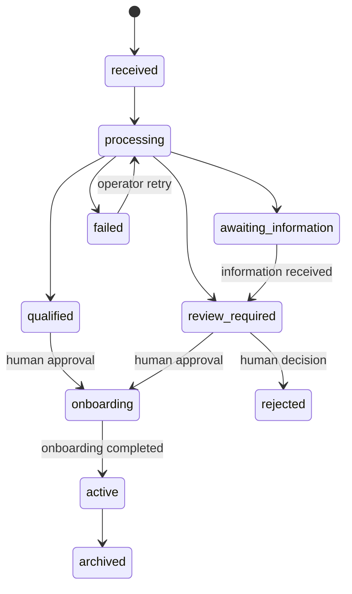

# Technical architecture

## Architectural style

The system combines a synchronous validation boundary with asynchronous workflow orchestration:

- **FastAPI** owns domain validation, AI contracts, scoring, status invariants, document controls, email templates and audit writes.
- **n8n** owns visible orchestration and integration sequencing, but not sensitive business rules.
- **PostgreSQL** is the system of record and supports a Supabase migration path.
- **Outbox worker** provides reliable event delivery without requiring Kafka for a small-firm MVP.
- **Streamlit** provides a fast internal review interface backed only by authenticated API calls.

This avoids placing critical rules in low-code nodes while still demonstrating n8n automation.

## Context diagram

## Trust boundaries

1. **Public boundary:** browser and JSON intake. Treat all fields, filenames and headers as untrusted.
2. **Internal service boundary:** n8n and dashboard use separate API keys. In production replace them with workload identity and user SSO.
3. **AI boundary:** only minimized lead fields are sent. The model response is untrusted until schema validation.
4. **Storage boundary:** uploaded files are untrusted binary content and must not be executed or rendered inline.
5. **Reviewer boundary:** reviewer changes are privileged and require an audit reason.

## Intake transaction

`create_lead` executes these writes atomically:

1. insert `leads`;
2. insert `outbox_events` with lead ID and correlation ID;
3. insert `audit_events` with pseudonymized IP/user-agent metadata;
4. commit once.

The API does not call n8n inside the request transaction. This prevents a remote timeout from creating an ambiguous “workflow ran but lead was not committed” state.

## Outbox delivery semantics

- Delivery is **at least once**.
- Workers claim rows with `FOR UPDATE SKIP LOCKED`.
- A claimed event becomes `processing` and increments `attempts`.
- Success changes it to `delivered`.
- Failure returns it to `pending` with exponential delay.
- After the configured attempt limit it becomes `dead_letter`.

Each event carries a stable event ID. The processing endpoint stores completed IDs in `processed_events` in the same transaction as the score and audit record. A redelivered event returns `already_processed=true`, and the n8n workflow deliberately emits no further emails. A production deployment should additionally use a processing lease or advisory lock to close the narrow concurrent-first-delivery race.

## AI processing

The AI never calculates the lead score. This separation provides reproducibility, safer prompt changes and a clear appeal/review path.

## Database model

- `leads` — current aggregate state and minimized intake data;
- `lead_scores` — immutable score history with version and breakdown;
- `documents` — metadata, hash and validation state, not extracted content;
- `interactions` — redacted communication metadata;
- `workflow_runs` — normalized execution failures and states;
- `outbox_events` — reliable integration events;
- `audit_events` — append-only decision provenance;
- `idempotency_keys` — public API replay protection;
- reporting views — stable read model for Streamlit/Power BI.

## State model

The implementation currently writes directly from `received` to the processing result. The explicit `processing` state is retained for a future long-running worker or UI progress indicator.

## Deployment profiles

### Local portfolio demo

Docker Compose, local PostgreSQL, local volume for uploads, Mailpit, n8n and Streamlit.

### Small production deployment

Managed PostgreSQL/Supabase, private object storage, managed SMTP, TLS reverse proxy, secret manager, SSO, centralized logs, backup/restore automation and an isolated n8n instance.

### Enterprise extension

Queue-based workers, separate read model, OpenTelemetry traces, private networking, HSM/KMS-managed encryption, policy engine, immutable audit sink and tenant-level data isolation.

## Key trade-offs

- **FastAPI plus n8n rather than only n8n:** more code, but testable invariants and reduced secret/business-rule sprawl.
- **Outbox rather than Kafka:** lower operational cost and sufficient scale for an accounting-firm demo.
- **Streamlit rather than React:** faster portfolio delivery; production UX and authentication would likely move to a full web application.
- **Local files rather than MinIO:** fewer demo services; production must use private malware-scanned object storage.
- **Direct Postgres rather than full local Supabase stack:** simple startup while retaining SQL compatibility.
